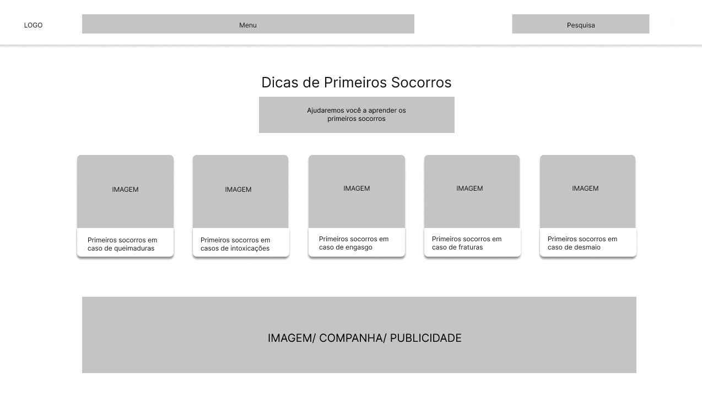
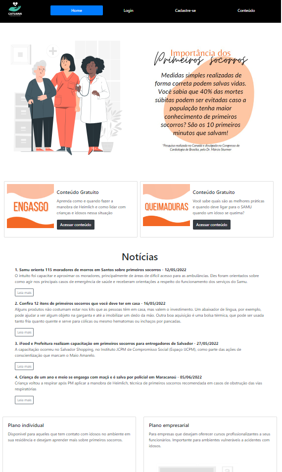

# TRABALHO TIAW

`Tema`

Desconhecimento Sobre Primeiros Socorros

`Curso`

Primeiro Período - Ciência da Computação PUC Minas Coração Eucarístico

## Participantes

Os membros do grupo são: 
- André Lucas Pardinho Ferreira Ferraz
- Gabriel Vargas Bento de Souza
- Gabriela Colem Castelo Borges
- Stefani da Silva Honório 

# Estrutura do Documento

- [Informações do Projeto](#informações-do-projeto)
  - [Participantes](#participantes)
- [Estrutura do Documento](#estrutura-do-documento)
- [1.Introdução](#introdução)
  - [1.1.Problema](#problema)
  - [1.2.Objetivos](#objetivos)
    - [1.2.1.Objetivo Geral](#objetivo-geral)
    - [1.2.2.Objetivos Específicos](#objetivos-especificos)
  - [1.3.Justificativa](#justificativa)
  - [1.4.Público-Alvo](#público-alvo)
- [2.Especificações do Projeto](#especificações-do-projeto)
  - [2.1.Personas e Mapas de Empatia](#personas-e-mapas-de-empatia)
  - [2.2.Histórias de Usuários](#histórias-de-usuários)
  - [2.3.Requisitos](#requisitos)
    - [2.3.1.Requisitos Funcionais](#requisitos-funcionais)
    - [2.3.2.Requisitos não Funcionais](#requisitos-não-funcionais)
  - [2.4.Restrições](#restrições)
- [3.Projeto de Interface](#projeto-de-interface)
  - [3.1.User Flow](#user-flow)
  - [3.2.Wireframes](#wireframes)
  - [3.3.Protótipo Funcional](#protótipo-funcional)
- [4.Gerenciamento de Projeto](#gerenciamento-de-projeto)
  - [4.1.Divisão de Papéis](#divisão-de-papéis)
  - [4.2.Metodologia](#metodologia)
  - [4.3.Controle de Versão](#controle-de-versão)
- [5.Arquitetura da Solução](#arquitetura-da-solução)
  - [5.1.Tecnologias Utilizadas](#tecnologias-utilizadas)
  - [5.2.Diagrama de Componentes](#diagrama-de-componentes)
  - [5.3.Hospedagem](#hospedagem)
  - [5.4.Template do Site](#template-do-site)
     - [5.4.1.Tela Inicial](#tela-inicial)
     - [5.4.2.Página de Cadastro](#página-de-cadastro)
     - [5.4.3.Tela Inicial](#tela-inicial)
     - [5.4.4.Tela Inicial](#tela-inicial)
     - [5.4.5.Tela Inicial](#tela-inicial)
  - [5.5.Funcionalidades dos Sistemas](#funcionalidades-dos-sistemas)
     - [5.5.1.Tela Inicial](#tela-inicial)
     - [5.5.2.Página de Cadastro](#página-de-cadastro)
     - [5.5.3.Tela Inicial](#tela-inicial)
     - [5.5.4.Tela Inicial](#tela-inicial)
     - [5.5.5.Tela Inicial](#tela-inicial)
- [6.Avaliação da Aplicação](#avaliação-da-aplicação)
  - [6.1.Plano de Testes de Sofware](#plano-de-testes-de-software)
  - [6.2.Registro de Testes de Software](#registro-de-testes-de-software)
  - [6.3.Plano de Testes de Usuabilidade](#plano-de-testes-de-usuabilidade)
  - [6.4.Registro de Testes de Usuabilidade](#registro-de-testes-de-usuabilidade)
- [7.Referências](#referências)

# Introdução

## Problema

  Pode-se definir primeiros socorros como sendo os cuidados imediatos que devem ser prestados rapidamente a uma pessoa, a vítima de acidentes ou de mal súbito, com o fim de manter as funções vitais e de evitar o agravamento de suas condições, aplicando medidas e procedimentos até a chegada de assistência qualificada. Entretanto, é notório que a maioria da população brasileira não apresenta os conhecimentos básicos para prestar tal ajuda, o que pode agravar o estado clínico do paciente. Esse desconhecimento tem como causa a falta e a dificuldade de acesso à informação, a negligência e o medo populacional. Logo, é um problema evidente que necessita de soluções práticas e inovadoras.

## Objetivos

### Objetivo Geral

  Tem-se o objetivo de desenvolver um software capaz de ampliar o conhecimento e a divulgação sobre os cuidados e as práticas relacionados aos Primeiros Socorros.

### Objetivos especificos

- Exemplificar e identificar as formas de acidentes mais presentes;
- Minimizar as possíveis vítimas de acidentes em casa;
- Colaborar com a área da saúde e da medicina, no que tange ao atendimento de urgência;
- Disponibilizar, no site, o conhecimento, utilizando videoaulas e tutoriais;
- Sanar dúvidas sobre a prática do rápido salvamento em casos de acidentes;
- Divulgar sites, vídeos e textos relacionados a Primeiros Socorros;
- Maximizar o conhecimento sobre Primeiros Socorros;
- Combinar praticidade, rapidez e simplicidade durante a criação do software;
- Planejar e solucionar a falta de divulgação acerca dos Primeiros Socorros;
- Proporcionar uma área virtual de acesso a uma grande parcela populacional;
- Quebrar o paradigma de ser difícil, demorado e complexo o estudo sobre Primeiros Socorros;
- Demonstrar o quão válido e necessário é o aprendizado nesta área;
- Mediar o conhecimento entre o atendimento médico de urgência e as vítimas;
- Capacitar uma maior parte da população para saber lidar com acidentes domésticos.

## Justificativa

  O que impulsionou a realização deste trabalho foi o entendimento de que desinformação, em grande escala, acerca dos primeiros socorros é extremamente perceptível, inclusive, no cotidiano. Assim, tendo como base a necessidade de uma ampliação dos meios de divulgação, a escolha de um recorte temático para o tema acidentes com idosos foi feita, visando a acidentes recorrentes e que, em muitos casos, não há uma atitude correta de auxílio e de socorro.
  
  Justificativa com apresentação de dados comprobatórios ou questionários realizados pelo grupo.

## Público-Alvo

  O público alvo do projeto compreende tanto empresas que, em parceria com o site, seriam beneficiadas de um material interativo com os usuários do serviço, facilitando na aprendizagem de manobras e de procedimentos corretos a serem realizados em situações emergenciais. Quanto quem convive com a parcela populacional idosa, podendo adquirir conhecimentos prévios e seres capacitados a lidar com situações de urgência, no que se tange à área da saúde. 
  
  Definição clara de público contemplando ao menos dois itens (faixa etária, nível de escolaridade, segmento de atuação, localização geográfica) 

 
# Especificações do Projeto

  Durante o processo de entendimento e de consolidação das ideias, foram criadas três personas, com seus respectivos mapas de empatia, representado um válido mecanismo de compreensão do problema, bem como uma forma de tornar a ideia mais palpável. Os aspectos mais relevantes, favoráveis ou não à resolução do desafio levantado, foram articulados na parte de histórias de usuários e, em seguida, elucidados na área de requisitos e de restrições.

## Personas e Mapas de Empatia

**Fabiana**

Figura 1 - Persona Fabiana

Ela tem 38 anos e trabalha como médica em uma Casa de Idosos, pois gosta de mudar o mundo e de fazer diferença na vida das pessoas. Pretende, sempre que possível, disponibilizar um maior conhecimento aos colegas de profissão e aos parentes de seus pacientes. Entretanto, ela se sente triste por não conseguir divulgar o suficiente sobre Primeiros Socorros para além dos muros de seu trabalho, o que dificulta o salvamento de vidas. Embora tenha perdido conhecidos devido à falta de tratamento correto, é motivada, diariamente, pela felicidade de quem ela trata com o devido suporte. Acreditando, então, que um site possa facilitar em todo esse processo.

**Lucas:**

Figura 2 - Persona Lucas

Ele é um jovem de 18 anos, que, mesmo ainda na faculdade, sonha em trabalhar ensinando futebol às crianças. Durante o tempo livre, adora ir à academia para relaxar e para desestresar. Faz trabalhos voluntários quando pode e sente enorme prazer e realização nessa atividade, pois, durante a infância, sentiu falta desse carinho. Ele pensa que, além de ele aprender os primeiros socorros para utilizar em sua futura profissão, uma vez que é um ambiente propicio a situações de emergência, ele vai utilizar o site caso aconteça algum acidente enquanto ele faz trabalho voluntário em asilos ou em creches. Sendo, assim, um excelente mecanismo de divulgação de conhecimento.

**Helena:** 

Figura 3 - Persona Helena

Ela é uma jovem de 18 anos de idade e estuda psicologia. Amante de livros de romance e de estudos sobre a mente humana, Helena mora com a avó, já idosa, e com seus pais. Embora, com muita dificuldade, procure saber sobre Primeiros Socorros para a sua avó, sente-se extremamente despreparada para prestar o socorro necessário em caso de acidente, o que a deixa com muito medo. Ela vê que o seu ciclo familiar apresenta o mesmo sentimento, mas que adoraria estar mais apta para prestar ajuda de emergência. Acredita, então, que um software será de grande valor para ganhar confiança e, também, segurança para realizar o tratamento.

## Histórias de Usuários

Com base na análise das personas forma identificadas as seguintes histórias de usuários:

|EU COMO... `PERSONA`| QUERO/PRECISO ... `FUNCIONALIDADE`  |PARA ... `MOTIVO/VALOR`                           |
|--------------------|-------------------------------------|--------------------------------------------------|
| Fabiana            | um site mais divulgado              | conseguir salvar mais pacientes                  | 
| Fabiana            | informações corretas e comprovadas  | evitar que medidas erradas sejam tomadas         |
| Fabiana            | uma plataforma online               | poder recomendar aos pacientes e a parentes deles|
| Fabiana            | videoaulas com médicos              | mostrar procedimentos válidos                    |
| Fabiana            | canal de comunicação com emergência | possibilitar um socorro rápido                   |
| Fabiana            | hiperlinks com mais informações     | ampliar o leque de conhecimento                  |
| Fabiana            | poder fazer comentários             | disponível a outros usuários/pacientes           |
| Fabiana            | cadastro diferencial a médicos      | compartilhar em reuniões da Casa de Idosos       |
| Lucas              | incluir informações sobre esporte   | que alunos e colegas de profissão acessem        |
| Lucas              | software disponível para celular    | poder acessar mais facilmente em campo           |
| Lucas              | falas de especialistas              | conseguir passar segurança aos colegas           |
| Lucas              | parceria com uma empresa de esporte | possibilitar um engajamento dos jogadores        |
| Helena             | acesso rápido e simplificado        | saber cuidar da sua avó                          |
| Helena             | site simples e acessível            | que parentes e familiares possam usar            |
| Helena             | explicação simples e eficaz         | sua avó poder abrir caso precise                 |
| Helena             |demonstração de cada tipo de acidente| se sentir preparada em variadas situações        |
| Helena             | poder abrir no celular              |ser prática, pois computador pode demorar         |

## Requisitos

As tabelas que se seguem apresentam os requisitos funcionais e não funcionais que detalham o escopo do projeto.

### Requisitos Funcionais

|ID    | Descrição do Requisito                                                            | Prioridade |
|------|-----------------------------------------------------------------------------------|------------|
|RF-001| O site deve possibilitar o cadastro de links de sites e de vídeos para divulgação | ALTA       | 
|RF-002| O site deve possibilitar canal de comunicação direta com canais de emergência     | ALTA       |
|RF-003| O site deve exemplificar os tipos de acidentes mais comuns                        | ALTA       |
|RF-004| O site deve proporcionar videoaulas informativas e verdadeiras sobre prevenção    | ALTA       |
|RF-005| O site deve disponibilizar o tipo de socorro preciso às situações comuns          | ALTA       |
|RF-006| O site deve permitir o cadastro de usuários                                       | MÉDIA      |
|RF-007| O site deve permitir o cadastro de médicos                                        | MÉDIA      |
|RF-008| O site deve ter área exclusiva para discussão no esporte                          | BAIXA      |
|RF-009| O site deve exibir comentários de médicos sobre as aulas                          | BAIXA      |
|RF-010| O site deve exibir notícias relacionadas aos Primeiros Socorros                   | BAIXA      |

### Requisitos não Funcionais

|ID     | Descrição do Requisito                                                         | Prioridade |
|-------|--------------------------------------------------------------------------------|------------|
|RNF-001| O site deve ser responsivo para rodar em dispositivos móveis                   | ALTA       | 
|RNF-002| O site deve ser de acesso fácil, fluido e simplicado                           | ALTA       |
|RNF-003| O site deve possuir compatibilidade com maior parte dos navegadores            | ALTA       |
|RNF-004| O site deve apresentar um layout clean e intuitivo                             | ALTA       | 

## Restrições

O projeto está restrito pelos itens apresentados na tabela a seguir.

|ID| Restrição                                                               |
|--|-------------------------------------------------------------------------|
|01| O projeto final deverá ser entregue até o final do semestre (03 / 07)   |
|02| Não pode ser desenvolvido um módulo de backend                          |
|03| O site deve ser feito exclusivamente pelos estudantes do curso          |

# Projeto de Interface

  Após um maior entendimento e esclarecimento sobre a ideia, utilizando as personas, as histórias de usuários e os requisitos, percebe-se que o ponto diferencial do projeto deverá ser um site que proporcione fluidez e agilidade durante o uso, uma vez que, por se tratar de Primeiros Socorros, o tempo é, sem dúvida, um elemento de extremo valor. Ademais, um layout clean é importante para não confundir o usuário durante a utilização. Tendo isso em vista, desenhou-se a seguinte interface:

## User Flow

  O User Flow, representado pela Figura 4, mostra, de forma simplificada, a interação que será proporcionada entre o usuário e o software. Cada processo de telas está devidamente legendado.

Figura 4 - Fluxo de telas do Usuário

## Wireframes

Os Wireframes, baseados no User Flow e retratados nas figuras 5 a 9, apresentam sistemas de telas com interações simples, rápidas e práticas, visando, sempre, a um acesso facilitado pelo usuário, de modo a plataforma servir como um facilitador, e não um dificultador no processo dos Primeiros Socorros.

Figura 5 - Página Inicial

Figura 6 - Página Inicial (alternativa)

Figura 7 - Página de Pesquisa

Figura 8 - Página Principal

Figura 9 - Página de Comentários

## Protótipo Funcional

# Gerenciamento de Projeto

## Divisão de Papéis

  O trabalho precisou, sem dúvidas, ser dividido entre os quatro integrantes para que fosse completado com sucesso.
  
  Foi utilizado, então, o Miro para ser feito um controle de entrada das tarefas do trabalho. Cada um dos elementos do Sprint 1 foi separado entre a equipe, de modo que, ao mesmo tempo que em todos tivessem conhecimento sobre as partes do projeto, não haveria uma sobrecarga a um único integrante apenas. Subdividiu-se as partes, e cada um liderou uma delas do trabalho, contribuindo para a organização dos outros. Durante as Sprints 2 e 3, o grupo foi, de certa forma, separado para cumprir todas as demandas que seriam implementadas no site. Para tanto, a ideia foi de que, em discussões semanais durantes as aulas da disciplina, o grupo se reunisse, discutindo o que já estava pronto e o que ainda seria concretizado. Vale ressaltar, porém, que, para manter o desing harmÔnico de toda a plataforma, as deciões principais — como layout, cor, tamanho, imagens — foram tomadas em conjunto. Além disso, um grupo no WhatsApp foi impressindível para que fossem debatidas novas ideias para o projeto. Por fim, para a Sprint 4, o grupo esteve mais unido, pois compilou-se os projetos realizados anteriormente e finalizou-se as demanadas restantes.
 
- André Feraz -> organizou a parte de User Flow e de Wireframe na documentação; criou a área de login.
- Gabriel Vargas -> dirigiu a parte da documentação; implementou a parte de cadastro, remoção e alteração das videoaulas, utilizando json; proporcionou a apresentação dessas informações no site.
- Gabriela Colem -> responsabilizou-se pela parte das apresentações; criou todo o layout padrão do site das principais tela; adicionou a funcionalidade para apresentação de notícias pelo json.
- Stefani da Silva -> organizou a parte de User Flow e de Wireframe na documentação; criou a área de cadastro.

## Metodologia

  A metodologia utilizada compreende os mecanismos utilizados para que o projeto fosse concluído de uma maneira prática e suave. Em especial, tomou-se como base o Design Thinking. Para tanto, inicialmente, realizou-se um brainstore no Miro, visando à obtenção de ideias e de pensamentos, de forma a startar o trabalho. Em seguida, foi feito um Google Forms com as perguntas direcionadoras de ideias e, em seguida, uma análise completa dos resultados. Dessa forma, foi possível perceber as demandas dos futuros usuários do software e compreender profundamente os tipos de perfis e as possíveis personas. 
  Assim, foi possível aprimorar e lapidar as ideias tidas no início do trabalho e, com elas, iniciar a parte de requisitos funcionais e não funcionais. Logo, foram realizados o User Flow e o Wireframe, com o Figma, tendo sempre em vista as determinações dos usuários do serviço.

## Controle de Versão

  Não ocorreu, ainda, o início da criação do software para, assim, poder ocorrer a adoção dos mecanismos e das ferramentas de controle de versão. 

  Entretando, espera-se o uso da ferramenta de controle de versão como sendo o [Git](https://git-scm.com/) e, também, o [Github](https://github.com) para hospedagem do repositório `upstream`.

  Para facilitar, a utilização dos seguintes mecanismos pode ser útil:
  
  O projeto seguir a seguinte convenção para o nome de branchs:
 
- `master`: versão estável já testada do software;
- `unstable`: versão já testada do software, porém instável;
- `testing`: versão em testes do software;
- `dev`: versão de desenvolvimento do software.

  Quanto à gerência de issues, o projeto adotar a seguinte convenção para etiquetas:

- `bugfix`: uma funcionalidade encontra-se com problemas;
- `enhancement`: uma funcionalidade precisa ser melhorada;
- `feature`: uma nova funcionalidade precisa ser introduzida.

# Arquitetura da Solução

......  COLOQUE AQUI O SEU TEXTO ......

## Tecnologias Utilizadas

|`NOME/PLATAFOTMA`           | `FUNCIONALIDADE`         |`LINK DE ACESSO`                                                                               |
|----------------------------|--------------------------|-----------------------------------------------------------------------------------------------|
|Processo de Design Thinkgin | Miro                     | https://miro.com/app/board/uXjVOB68uOY=/                                                      |
|Repositório de código       | GitHub                   | https://github.com/ICEI-PUC-Minas-PMGCC-TI/tiaw-pmg-cc-m-20221-t3-g2-primeiros-socorros-3     | 
|User Flow                   | Figma                    | https://www.figma.com/file/gfqgNdxjHh7YSI8eMX13BK/User-flow--Primeiros-socorros?node-id=0%3A1 | 
|Wireframes                  | Figma                    | https://www.figma.com/file/KxY5qxhoxyo6xGYenlH0Rg/Wireframe-Primeiros-Socorros?node-id=8%3A372|
|HTML                        | Linguagem de marcação    | --                                                                                            |
|CSS                         | Linguagem de estilo      | --                                                                                            |
|JavaScript                   | Linguagem de programação | --                                                                                            |
|Bootstrap                   | Framework                | https://getbootstrap.com/           
|Visual Studio Code          | Editor de texto          | https://code.visualstudio.com/
|Replit                      | Hospedagem do site       | link site
|Canva                       | Apresentação slide I     | https://www.canva.com/design/DAE-EYoqQd0/Q5qoWJlzMyKO4IEzne_oDg/view?utm_content=DAE-EYoqQd0&utm_campaign=designshare&utm_medium=link&utm_source=publishsharelink                                                                            |
|Canva                       | Apresentação slide II    | link slide 2                                                                                  |

As ferramentas empregadas neste projeto foram:

 * Processo de Design Thinkgin: Miro
O site é um quadro branco onlide, e ele foi escolhido, pois possibilita, em equipe, um compartilhamento de ideias instantâneo e interativo. Além disso, apresenta algumas funcionalidades, como uso de post-it, checklists e fluxogramas.

* Repositório de código: GitHub
Embora o principal motivo de utilização tenha sido a disponibilização pela PUC, é uma ferramenta incrível, pois permite a criação de pastas e de documentos, bem como a utilização por toda a equipe.

* User Flow e Wireframes: Figma
O software Figma é uma ferramenta excelente para a criação de protótipos relacionados à criação dos sites, pois tem um layout fácil e prático e, também, permite que o grupo trabalhe junto.

* HTML. CSS e JavaScript
Linguagens presentes no ambiente de sevenvolvimneto da web, sendo utilizadas para a criação do site e para a adição de recursos interativos.

* Editor de texto: Visual Studio Code
Devido ao grupo já estar ambientado com esta ferramente, escolheu-se para a edição dos códigos antes de serem adicionados ao Github. Vale ressaltar a extensão "Live Server" que permitiu a visualização em tempo real das alterações no código.

* Hospedagem do site: Replit
A ferramenta foi essencial para que se publicar o site criado e, assim, torná-lo público e acessível na web.

* Apresentações: Canva
A ferramenta online permite, dentre muitas funcionalidades, a criação de apresentação de slides simplificados e bem estruturados, de modo a tornar a apresentação mais clara e atrativa.

## Diagrama de Componentes
Os componentes que fazem parte da solução implementada estão divididos em dois principais módulos, contendo, cada um, suas subdivisões:

* **Navegador**: Interface principal do sistema.
   * **Página Web**: Conjunto de arquivos do tipo HTML, CSS, JavaScript, incluindo JSON, e algumas imagens, por exemplo, a logo do site.
   * **Local Storage**: Armazenamento local no Navegador, no qual os dados são obetidos dados do JSON, porém, ao cadastrar novas informações localmente, o JSON perde a utilizade, e o Local Storage mantém as informações.
      * **Notícias**: Nesta seção, são apresentadas notícias sobre Primeiros Socorros, a partir de um JSON.
      * **Vídeos**: Parte composta pelas publicações principais do site, contendo videoaulas do YouTube, links de sites, informações e descrições sobre os procedimentos de Primeiros Socorros.
      * **Cadastros**: Foi adicionado, também, cadastros inicias para o software, contemplando os usuários e os médicos.
* **Hospedagem**: Local da web, no qual se encontram as páginas implementadas.

## Hospedagem
Para este projeto, foi utilizada a plataforma Replit para hospedagem do site. Este se encontra no seguinte link: 

## Template do Site e Funcionalidades

  Nesta seção, são apresentadas as telas desenvolvidas para cada uma das funcionalidades do sistema:

### Tela Inicial da Home

  Esta é a home do site. Nela, há conteúdos estáticos, como pequenos textos explicativos sobre Primeiros Socorros e sobre conteúdos e tipos de planos. Vale ressaltar que a parte dos planos não está como desejada, visto que era a ideia fazer a página de cadastro com as informações sobre pagamento para contratação dos planos desejados. Além disso, há uma parte com notícias sobre acontecimentos relacionados às técnicas de primeiros socorros, as quais são retiradas de um json.

**Artefatos de código**
index.html
style-home.css
script-noticias.js

**Requisitos Atendidos:**
RF-010: O site deve exibir notícias relacionadas aos Primeiros Socorros  

**Estrutura de Dados:**
JSON das notícias exibidas:

**Intruções de acesso:**

**Link ambiente funcional**
Link:

### Página de Cadastro de Usuário

**Artefatos de código**
cadastro.html
style-login.css

**Link ambiente funcional**
Link:

### Página de Login

### Página de Cadastro de Informação

### Página Introdução das Informações

**Artefatos de código**
index.html
style-home.css

**Link ambiente funcional**
Link:

### Página de Apresentação das Informações

## Funcionalidade do Sistema

Print das telas implementadas com descrição breve sobre os recursos providos na aplicação.
Funcionalidade dinâmica a partir de artefatos de código em JavaScript para UMA das soluções: 
Manipulação de dados em JSON com persistência no browser (localStorage) ou em servidor.
Interação via AJAX com API disponível na Internet ou do próprio sistema.
Animação de elementos da página com propósito de atender funcionalidade documentada na especificação. Ex: jogos, calculadoras.
Ambiente funcional publicado na Internet (Ex: Repl.it, Heroku, GitHub Pages)

### Tela inicial

### Página de Cadastro de Usuário

### Página de Login

### Página de Cadastro de Informação

Nesta tela, há a parte de cadastro dos conteúdos por parte dos médicos. Existe um JSON inicial com alguns pré-cadastros, mas são armazenados no LocalStorage em seguida.

**Requisitos Atendidos:**
* RF-001: O site deve possibilitar o cadastro de links de sites e de vídeos para divulgação

**Artefatos da Funcionalidade:**
* index-informacoes-cadastro.html
* index-informacoes.html
* style-informacoes.css
* script-informacoes.js

**Estrutura de Dados:**

PRINT JSON

### Página de Apresentação das Informações

**Entrega Sprint2 - Apresentação das videoaulas e das informações complementares sobre Primeiros Socorros:**

PRINT PAGINA

Aluno responsável: Gabriel Vargas Bento de Souza

Link do código:

Nesta tela, há a parte de apresentação dos conteúdos cadastrados pelos médicos.

**Requisitos Atendidos:**
* RF-003: O site deve exemplificar os tipos de acidentes mais comuns                     
* RF-004: O site deve proporcionar videoaulas informativas e verdadeiras sobre prevenção
* RF-005: O site deve disponibilizar o tipo de socorro preciso às situações comuns

**Artefatos da Funcionalidade:**

# Avaliação da Aplicação

......  COLOQUE AQUI O SEU TEXTO ......

> Apresente os cenários de testes utilizados na realização dos testes da
> sua aplicação. Escolha cenários de testes que demonstrem os requisitos
> sendo satisfeitos.

## Plano de Testes de Software

Plano de testes identificando os objetivos do teste, os passos para o teste e os resultados esperados com referência aos requisitos associados (min. 8 casos de testes funcionais e 2 não funcionais)

Requisitos para realização do teste:
* Site publicado na Internet
* Navegador da Internet - Chrome, Firefox ou Edge

Os testes funcionais do software a serem realizados estão descritos a seguir.

|Caso de Teste        | CT-01-Cadastrar usuário OK                          |
|---------------------|-----------------------------------------------------|
|Requisitos Associados| RF-006: O site deve permitir o cadastro de usuários |
|Objetivo do teste    | Verificar se usuário consegue se cadastrar no site  |
|Passos               | 1. Acessar o navegador   2. Entrar no endereço do site   3. Clicar "Cadastro" no menu   4. Preencher as informações solicitadas, não necessariamente reais, porém deve manter o formato correto   5. No campo "Tipo de cadastro", selecionar usuário   6. Clicar em "Cadastrar"   |
|Critérios de Êxito   | Ao clicar em "Cadastrar", caso todas as informações tenham sido preenchidas, deve aparecer mensagem de cadastro concluído, e nenhum erro pode ser apresentado.                                                            |

|Caso de Teste        | CT-02-Cadastrar usuário NÃO OK                      |
|---------------------|-----------------------------------------------------|
|Requisitos Associados| RF-006: O site deve permitir o cadastro de usuários |
|Objetivo do teste    | Verificar se usuário é impedido de se cadastrar no site caso preencha algum campo incorretamente |
|Passos               | 1. Acessar o navegador   2. Entrar no endereço do site   3. Clicar "Cadastro" no menu   4. Preencher as informações solicitadas, porém erroneamente. Por exemplo, nome com dígitos, CPF e número de celular com letras, e-mail sem o @, senhas diferentes   5. No campo "Tipo de cadastro", selecionar usuário   6. Clicar em "Cadastrar"   |
|Critérios de Êxito   | Ao clicar em "Cadastrar", deve aparecer mensagem de erro nos campos preenchidos incorretamente, e o cadastro NÃO pode ser criado |                                                      |

|Caso de Teste        | CT-03-Cadastrar médico OK                           |
|---------------------|-----------------------------------------------------|
|Requisitos Associados| RF-007: O site deve permitir o cadastro de médicos  |
|Objetivo do teste    | Verificar se médico consegue se cadastrar no site   |
|Passos               | 1. Acessar o navegador   2. Entrar no endereço do site   3. Clicar "Cadastro" no menu   4. Preencher as informações solicitadas, não necessariamente reais, porém deve manter o formato correto   5. No campo "Tipo de cadastro", selecionar médico   6. Clicar em "Cadastrar"   |
|Critérios de Êxito   | Ao clicar em "Cadastrar", caso todas as informações tenham sido preenchidas, deve aparecer mensagem de cadastro concluído, e nenhum erro pode ser apresentado.                                                            |

|Caso de Teste        | CT-04-Cadastrar médico NÃO OK                       |
|---------------------|-----------------------------------------------------|
|Requisitos Associados| RF-007: O site deve permitir o cadastro de médicos  |
|Objetivo do teste    | Verificar se usuário é impedido de se cadastrar no site caso preencha algum campo incorretamente |
|Passos               | 1. Acessar o navegador   2. Entrar no endereço do site   3. Clicar "Cadastro" no menu   4. Preencher as informações solicitadas, porém erroneamente. Por exemplo, nome com dígitos, CPF e número de celular com letras, e-mail sem o @, senhas diferentes   5. No campo "Tipo de cadastro", selecionar médico   6. Clicar em "Cadastrar"   |
|Critérios de Êxito   | Ao clicar em "Cadastrar", deve aparecer mensagem de erro nos campos preenchidos incorretamente, e o cadastro NÃO pode ser criado |  

|Caso de Teste        | CT-05-Relizar login usuário OK                      |
|---------------------|-----------------------------------------------------|
|Requisitos Associados| RF-006: O site deve permitir o cadastro de usuários |
|Objetivo do teste    | Verificar se usuários conseguem realizar login com dados cadastrados |
|Passos               | 1. Acessar o navegador   2. Entrar no endereço do site   3. Clicar "Login" no menu   4. Preencher os campos de e-mail e de senha previamente definidos no JSON (exemplo abaixo)   5. Clicar em "Entrar" |
|Critérios de Êxito   | * O usuário deve conseguir logar na página   * A página de conteúdos deve estar desbloqueada, ou seja, mostrar as videoaulas   * Deve aparecer o nome do usuário no canto superior da tela   * NÃO deve exibir um botão para cadastrar conteúdo |

| Login (e-mail)          | Senha       |
|-------------------------|-------------|
|gustavomaia@email.com    | Gustavo1234 |
|ivanpereira@email.com    | Ivan1234    |
|rodrigosantana@email.com | Rodrigo1234 |
|amandalima@email.com     | Amanda1234  |

|Caso de Teste        | CT-06-Relizar login usuário NÃO OK                  |
|---------------------|-----------------------------------------------------|
|Requisitos Associados| RF-006: O site deve permitir o cadastro de usuários |
|Objetivo do teste    | Verificar se usuários não cadastrados conseguem realizar login|
|Passos               | 1. Acessar o navegador   2. Entrar no endereço do site   3. Clicar "Login" no menu   4. Preencher os campos de e-mail e de senha SEM seguir os dados previamente definidos no JSON (exemplo acima) ou no cadastro feito localmente   5. Clicar em "Entrar" |
|Critérios de Êxito   | * O usuário não deve conseguir logar na página   * A página de conteúdos deve estar bloqueada, ou seja, não mostrar as videoaulas |

|Caso de Teste        | CT-07-Relizar login médico OK                       |
|---------------------|-----------------------------------------------------|
|Requisitos Associados| RF-007: O site deve permitir o cadastro de médicos  |
|Objetivo do teste    | Verificar se usuários conseguem realizar login com dados cadastrados |
|Passos               | 1. Acessar o navegador   2. Entrar no endereço do site   3. Clicar "Login" no menu   4. Preencher os campos de e-mail e de senha previamente definidos no JSON (exemplo abaixo)   5. Clicar em "Entrar" |
|Critérios de Êxito   | * O médico deve conseguir logar na página   * A página de conteúdos deve estar desbloqueada, ou seja, mostrar as videoaulas   * Deve aparecer o nome do médico no canto superior da tela   * Deve aparecer um botão para cadastrar conteúdo "Cadastre novas publicações" |

| Login (e-mail)          | Senha       |
|-------------------------|-------------|
|anadasilva@email.com     | Ana1234     |
|joanafontes@email.com    | Joana1234   |
|carlaalmeida@email.com   | Carla1234   |
|tulioalves@email.com     | Tulio1234   |
|joaquimpereira@email.com | Joaquim1234 |
|giovannecastro@email.com | Giovanne1234|
|pedromarques@email.com   | Pedro1234   |
|sandrarodrigues@email.com| Sandra1234  |

|Caso de Teste        | CT-08-Relizar login médico NÃO OK                   |
|---------------------|-----------------------------------------------------|
|Requisitos Associados| RF-007: O site deve permitir o cadastro de médicos  |
|Objetivo do teste    | Verificar se médicos não cadastrados conseguem realizar login|
|Passos               | 1. Acessar o navegador   2. Entrar no endereço do site   3. Clicar "Login" no menu   4. Preencher os campos de e-mail e de senha SEM seguir os dados previamente definidos no JSON (exemplo acima) ou no cadastro feito localmente   5. Clicar em "Entrar" |
|Critérios de Êxito   | * O médico não deve conseguir logar na página   * A página de conteúdos deve estar bloqueada, ou seja, não mostrar as videoaulas |

|Caso de Teste        | CT-09-Visualizar conteúdo inicial                   |
|---------------------|-----------------------------------------------------|
|Requisitos Associados| RF-003: O site deve exemplificar os tipos de acidentes mais comuns |
|Objetivo do teste    | Verificar se conteúdo está sendo exibido corretamente|
|Passos               | 1. Acessar o navegador   2. Entrar no endereço do site   3. Realizar login corretamente   4. Acessar página de conteúdo inicial |
|Critérios de Êxito   | * Deve haver 9 cards com detalhes sobre cada tipo de acidente   * Cada um deles deve conter uma pequna descrição retirada de um JSON   * Na parte inferior, haverá um botão para "Acessar aula"   * Será mostrado um contador da quantidade de publicações disponíveis em cada aula |

|Caso de Teste        | CT-10-Visualizar conteúdo principal                 |
|---------------------|-----------------------------------------------------|
|Requisitos Associados| RF-004: O site deve proporcionar videoaulas informativas e verdadeiras sobre prevenção   RF-005: O site deve disponibilizar o tipo de socorro preciso às situações comuns |
|Objetivo do teste    | Verificar se conteúdo principal está sendo exibido corretamente|
|Passos               | 1. Acessar o navegador   2. Entrar no endereço do site   3. Realizar login corretamente   4. Acessar página de conteúdo inicial   5. Escolher um dos nove cards presentes   6. Clicar em "Acessar aula" |
|Critérios de Êxito   | * Deve haver n cards com detalhes sobre cada tipo de acidente   * Cada um deles deve conter uma pequna descrição retirada de um JSON, contendo vídeo explicativo do YouTube, detalhamento, médico que postou, e-mail para contato   * Na parte inferior, haverá um botão para "Acessar site de Apoio"   * Este site deve levar a uma outra página da web sobre o tipo de acidente selecionado |

|Caso de Teste        | CT-11-Visualizar área de notícias                   |
|---------------------|-----------------------------------------------------|
|Requisitos Associados| RF-010: O site deve exibir notícias relacionadas aos Primeiros Socorros |
|Objetivo do teste    | Verificar se, na página home, são exibidas notícias retiradas do JSON   |
|Passos               | 1. Acessar o navegador   2. Entrar no endereço do site   3. Selecionar, no menu, "Home"   4. Descer um pouco na página |
|Critérios de Êxito   | * Deve haver uma área de notícias retiradas de um JSON   * Em cada uma delas, há título, referência, um trecho inicial e data   * Em baixo do texto, há um botão "Leia Mais" que deverá levar ao site do qual a notícia foi retirada |

......  COLOQUE AQUI O SEU TEXTO ......

> Enumere quais cenários de testes foram selecionados para teste. Neste
> tópico o grupo deve detalhar quais funcionalidades avaliadas, o grupo
> de usuários que foi escolhido para participar do teste e as
> ferramentas utilizadas.
> 
> **Links Úteis**:
> - [IBM - Criação e Geração de Planos de Teste](https://www.ibm.com/developerworks/br/local/rational/criacao_geracao_planos_testes_software/index.html)
> - [Práticas e Técnicas de Testes Ágeis](http://assiste.serpro.gov.br/serproagil/Apresenta/slides.pdf)
> - [Teste de Software: Conceitos e tipos de testes](https://blog.onedaytesting.com.br/teste-de-software/)

## Registros de Testes de Software

Relatório dos testes realizados com print das telas geradas nos testes (mín. de 8 testes)
Relatório de problemas identificados nos testes e propostas de correções/ajustes

......  COLOQUE AQUI O SEU TEXTO ......

> Discorra sobre os resultados do teste. Ressaltando pontos fortes e
> fracos identificados na solução. Comente como o grupo pretende atacar
> esses pontos nas próximas iterações. Apresente as falhas detectadas e
> as melhorias geradas a partir dos resultados obtidos nos testes.

## Plano de Testes de Usuabilidade
Planejamento dos testes de usabilidade a serem feitos com (1) identificação de objetivos a serem validados, (2) detalhes dos público a ser envolvido e  (3) roteiro detalhado das tarefas a serem desempenhadas pelos usuários (mínimo de 10 passos)

## Registros de Testes de Usuabilidade
Relatório com detalhamento das pessoas envolvidas no teste
Relatório de alterações decorrentes dos testes (min. de 8 testes com usuários)
Relatório de problemas identificados nos testes e propostas de correções/ajustes

# Referências

......  COLOQUE AQUI O SEU TEXTO ......

> Inclua todas as referências (livros, artigos, sites, etc) utilizados
> no desenvolvimento do trabalho.
> 
> **Links Úteis**:
> - [Formato ABNT](https://www.normastecnicas.com/abnt/trabalhos-academicos/referencias/)
> - [Referências Bibliográficas da ABNT](https://comunidade.rockcontent.com/referencia-bibliografica-abnt/)
